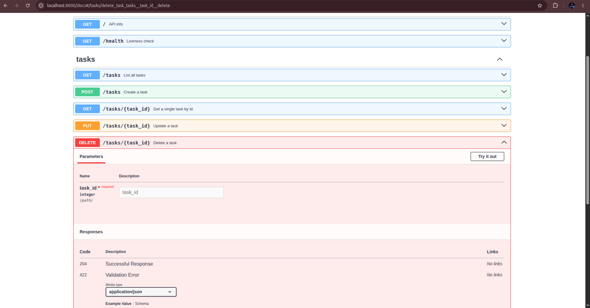
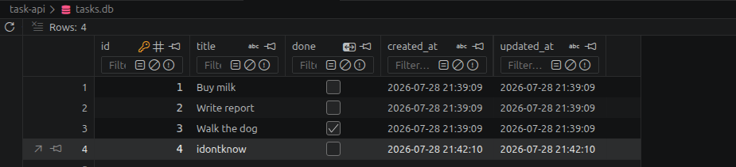

# Task API

A small in-memory to-do list API built with **FastAPI**. It supports the
four CRUD operations on tasks (create, read, update, delete), self-documents
via Swagger UI, and validates input before trusting it.

Built stage by stage as a learning exercise — each commit corresponds to one
stage.

## Install & run

```bash
git clone https://github.com/nafisrahman006/task-api.git
cd task-api
python3 -m venv venv
source venv/bin/activate      # Windows: venv\Scripts\activate
pip install -r requirements.txt
uvicorn main:app --reload --port 8000
```

The API is now live at `http://localhost:8000`, and interactive docs are at
`http://localhost:8000/docs`.

## Endpoints

| Method | Path           | Description                          | Success | Errors |
|--------|----------------|---------------------------------------|---------|--------|
| GET    | `/`            | API info (name, version, endpoints)   | 200     | —      |
| GET    | `/health`      | Liveness check                        | 200     | —      |
| GET    | `/tasks`       | List all tasks                        | 200     | —      |
| GET    | `/tasks/{id}`  | Get one task                          | 200     | 404    |
| POST   | `/tasks`       | Create a task (`{"title": "..."}`)    | 201     | 400    |
| PUT    | `/tasks/{id}`  | Update `title` and/or `done`          | 200     | 400, 404 |
| DELETE | `/tasks/{id}`  | Delete a task                         | 204     | 404    |

A task looks like: `{"id": 1, "title": "Buy milk", "done": false}`.

Errors are always returned as `{"error": "<message>"}` with the matching
HTTP status code — never a silent empty 200.

## Example

```
$ curl -i http://localhost:8000/tasks/1

HTTP/1.1 200 OK
content-type: application/json

{"id":1,"title":"Buy milk","done":false}
```

## Swagger UI

`/docs` is generated automatically by FastAPI from the code — every route
above shows up there with a **Try it out** button that fires real requests,
no `curl` needed.


*(screenshot of `/docs` goes here)*

## Notes on state

Tasks live in an in-memory Python list — there's no database. Restarting
the server resets the task list back to the three seed tasks; anything
created, updated, or deleted during a session is lost. That's the
trade-off of Stage 0–6: it's the simplest possible storage, and it's why a
real backend eventually needs a persistent database.


# Task API — Week 2 · Assignment 2

A lightweight REST API for managing tasks, built with **FastAPI** and backed by **SQLite**. This project replaces the in-memory storage from Assignment 1 with a real database, demonstrating that persistence is an implementation detail — the API itself stays exactly the same.

---

## Why SQLite was chosen

SQLite was chosen because it is a **zero-configuration, serverless database** that stores all data in a single file. This makes it ideal for learning and small projects:

- No separate database server to install or run
- The database file (`tasks.db`) is created automatically on first run
- Data survives server restarts
- Moving to PostgreSQL or MySQL later only requires changing the connection layer — the SQL queries and API remain largely identical

---

## Database file location

The database file is stored in the project root:

```
project-root/
├── main.py
├── database.py
├── requirements.txt
├── README.md
└── tasks.db          ← SQLite database file (auto-created)
```

> **Note:** `tasks.db` is created automatically when you start the server for the first time. You do not need to create it manually.

---

## How to start the project

### 1. Clone the repository

```bash
git clone https://github.com/nafisrahman006/task-api.git
cd YOUR_REPO_NAME
```

### 2. Create a virtual environment (optional but recommended)

```bash
python -m venv venv

# macOS / Linux
source venv/bin/activate

# Windows
venv\Scripts\activate
```

### 3. Install dependencies

```bash
pip install -r requirements.txt
```

### 4. Run the server

```bash
uvicorn database:app --reload
```

The API will be available at `http://127.0.0.1:8000`.

Interactive documentation (Swagger UI) is available at:

```
http://127.0.0.1:8000/docs
```

---

## API Endpoints

| Method | Endpoint | Description |
|--------|----------|-------------|
| GET | `/` | API info |
| GET | `/health` | Health check |
| GET | `/tasks` | List all tasks (supports search, filter, sort) |
| GET | `/tasks/{id}` | Get a single task |
| POST | `/tasks` | Create a new task |
| PUT | `/tasks/{id}` | Update a task |
| DELETE | `/tasks/{id}` | Delete a task |
| GET | `/stats` | Return task statistics |

### Query parameters for `GET /tasks`

| Parameter | Type | Description |
|-----------|------|-------------|
| `search` | string | Search titles using SQL `LIKE` (e.g., `?search=milk`) |
| `done` | boolean | Filter by status (`?done=true` or `?done=false`) |
| `sort` | string | Sort alphabetically by title (`?sort=title`) |

---

## Example SQL queries executed

During development, the database was explored directly using **DB Browser for SQLite**. Below is one example query:

```sql
-- Count all tasks
SELECT COUNT(*) FROM tasks;
```

Other queries executed:

```sql
-- List every task
SELECT * FROM tasks;

-- Show only completed tasks
SELECT * FROM tasks WHERE done = 1;

-- Mark every task as completed
UPDATE tasks SET done = 1;

-- Delete all completed tasks
DELETE FROM tasks WHERE done = 1;
```

Modifying the database manually through DB Browser and then calling the API immediately reflected those changes, confirming that the API reads directly from the database.

---

## Database viewer screenshot

Below is a screenshot of the `tasks` table opened in **DB Browser for SQLite**:




# Task API — Week 3 · Assignment 3 (Postgres + Docker)

A lightweight REST API for managing tasks, built with **FastAPI** and backed by **PostgreSQL** running in Docker. This project swaps the SQLite database from Assignment 2 for a real Postgres instance, proving that the storage layer is just an implementation detail — the API routes remain completely unchanged.

---

## Why Postgres + Docker was chosen

PostgreSQL is a production-grade relational database used by most real-world applications. Running it in Docker means:

- **Zero local installation** — no need to install Postgres directly on your machine
- **Reproducible environment** — every teammate gets the exact same database version
- **Data persistence** — Docker volumes ensure data survives container restarts
- **One-command startup** — `docker compose up` starts both the database and the app
- **Foundation for future weeks** — caching (Redis), background jobs, and RAG all assume this local stack

---

## Architecture

```
Client → FastAPI (main.py) → Repository (repository.py) → Postgres (Docker)
```

**Key design principle:** Only `repository.py` knows about Postgres. `main.py` (routes/service layer) has **zero SQL** and **zero database logic**. Swapping storage again (e.g., Postgres → MySQL) would only require changing `repository.py`.

---

## Project structure

```
.
├── .env                  # Gitignored — real DATABASE_URL (see .env.example)
├── .env.example          # Committed — template for other developers
├── .gitignore            # Ignores .env, __pycache__, *.db, venv/
├── Dockerfile            # Python image + dependency install
├── docker-compose.yml    # Postgres + Redis + app services with volume
├── init.sql              # Creates table + seeds 3 example tasks
├── main.py               # FastAPI routes (UNCHANGED from A2 — only imports swapped)
├── repository.py         # Postgres implementation (NEW — replaces SQLite logic)
├── requirements.txt      # Python dependencies
└── README.md             # This file
```

---

## Prerequisites

- [Docker](https://docs.docker.com/get-docker/)
- [Docker Compose](https://docs.docker.com/compose/install/)
- Python 3.11+ (for local development without Docker)

---

## Quick start

### 1. Clone the repository

```bash
git clone https://github.com/nafisrahman006/flyrank.ai-project.git
cd flyrank.ai-project/task-api
```

### 2. Create your environment file

```bash
cp .env.example .env
```

By default `.env` contains:

```bash
DATABASE_URL=postgresql://postgres:postgres@db:5432/tasks
```

> **Note:** `.env` is gitignored. Never commit it.

### 3. Start the entire stack

```bash
docker compose up --build
```

This command:
1. Pulls the Postgres 15 and Redis 7 images
2. Creates a named Docker volume (`postgres_data`) for persistence
3. Runs `init.sql` to create the table and seed 3 tasks (only on first run)
4. Builds the FastAPI app image
5. Starts the app once Postgres and Redis are healthy

### 4. Access the API

| URL | Description |
|-----|-------------|
| `http://localhost:8000` | API root |
| `http://localhost:8000/docs` | Interactive Swagger UI |
| `http://localhost:8000/health` | Health check |
| `http://localhost:8000/redis` | Redis connectivity check |

---

## API Endpoints

| Method | Endpoint | Description |
|--------|----------|-------------|
| GET | `/` | API info |
| GET | `/health` | Health check |
| GET | `/tasks` | List all tasks (supports search, filter, sort) |
| GET | `/tasks/{id}` | Get a single task |
| POST | `/tasks` | Create a new task |
| PUT | `/tasks/{id}` | Update a task |
| DELETE | `/tasks/{id}` | Delete a task |
| GET | `/stats` | Return task statistics |
| GET | `/redis` | Ping Redis (stretch goal) |

### Query parameters for `GET /tasks`

| Parameter | Type | Description |
|-----------|------|-------------|
| `search` | string | Search titles using SQL `ILIKE` (e.g., `?search=milk`) |
| `done` | boolean | Filter by status (`?done=true` or `?done=false`) |
| `sort` | string | Sort alphabetically by title (`?sort=title`) |

---

## Proving persistence across restarts

The assignment requires proving that data survives both an **app restart** and a **container restart**.

### Step 1 — Create data

```bash
curl -X POST "http://localhost:8000/tasks" \
  -H "Content-Type: application/json" \
  -d '{"title":"Survive restart"}'
```

### Step 2 — Verify it exists

```bash
curl http://localhost:8000/tasks
```

Response:
```json
[
  {"id":1,"title":"Buy milk","done":false,...},
  {"id":2,"title":"Write report","done":false,...},
  {"id":3,"title":"Walk the dog","done":true,...},
  {"id":4,"title":"Survive restart","done":false,...}
]
```

### Step 3 — Stop everything

```bash
docker compose down
```

### Step 4 — Start again

```bash
docker compose up
```

### Step 5 — Verify data is still there

```bash
curl http://localhost:8000/tasks
```

The task `"Survive restart"` is still present because the Docker volume `postgres_data` persists the database files on your host machine, independent of the container lifecycle.

---

## Environment configuration

| File | Purpose | Committed? |
|------|---------|------------|
| `.env` | Real secrets / connection strings | ❌ No (gitignored) |
| `.env.example` | Template showing expected variables | ✅ Yes |

This pattern ensures:
- Sensitive credentials never leak into version control
- New developers know exactly which variables to set
- Different environments (local, staging, production) can use different values

---

## Database initialization

The `init.sql` file is mounted into Postgres at `/docker-entrypoint-initdb.d/`. Postgres executes it **automatically on first run only**:

```sql
CREATE TABLE IF NOT EXISTS tasks (
    id SERIAL PRIMARY KEY,
    title TEXT NOT NULL,
    done BOOLEAN NOT NULL DEFAULT FALSE,
    created_at TIMESTAMP DEFAULT CURRENT_TIMESTAMP,
    updated_at TIMESTAMP DEFAULT CURRENT_TIMESTAMP
);

-- Seed 3 example tasks only if table is empty
INSERT INTO tasks (title, done) SELECT 'Buy milk', FALSE WHERE NOT EXISTS (SELECT 1 FROM tasks);
INSERT INTO tasks (title, done) SELECT 'Write report', FALSE WHERE NOT EXISTS (SELECT 1 FROM tasks);
INSERT INTO tasks (title, done) SELECT 'Walk the dog', TRUE WHERE NOT EXISTS (SELECT 1 FROM tasks);
```

Restarting the container will **not** re-seed duplicate data because of the `WHERE NOT EXISTS` guard.

---

## Repository pattern: what changed and what didn't

### What changed

- `repository.py` is new — it encapsulates all Postgres SQL using `psycopg2`
- `requirements.txt` added `psycopg2-binary` and `redis`
- `docker-compose.yml` and `Dockerfile` are new
- `init.sql` handles table creation and seeding

### What did NOT change

- `main.py` — every route (`GET /tasks`, `POST /tasks`, `PUT /tasks/{id}`, `DELETE /tasks/{id}`, `GET /stats`) is **identical** in structure and behavior to Assignment 2
- Request/response JSON shapes are the same
- Validation rules are the same (empty title → 400, missing ID → 404)
- Query parameters (`search`, `done`, `sort`) work exactly as before

This proves the architecture: **the API describes what the app does. The repository describes where it stores data.**

---

## Useful Docker commands

```bash
# Start everything in the background
docker compose up -d

# View logs
docker compose logs -f

# View only app logs
docker compose logs -f app

# View only database logs
docker compose logs -f db

# Stop everything
docker compose down

# Stop and delete the volume 
docker compose down -v

# Rebuild the app image after code changes
docker compose up --build

# Open a Postgres shell inside the container
docker compose exec db psql -U postgres -d tasks

# Open Redis CLI inside the container
docker compose exec redis redis-cli
```

---

## Connecting to Postgres directly

```bash
# Using the Docker Postgres client
docker compose exec db psql -U postgres -d tasks

# Inside psql, run:
\dt                    -- list tables
SELECT * FROM tasks;    -- view all tasks
\q                     -- quit
```

Or use any GUI client (TablePlus, DBeaver, pgAdmin) with:
- Host: `localhost`
- Port: `5432`
- Database: `tasks`
- User: `postgres`
- Password: `postgres`

---

## Stretch Goals

### 1. Redis connectivity

A `redis` service was added to `docker-compose.yml`. The app pings it via `GET /redis`:

```bash
curl http://localhost:8000/redis
```

Expected response:
```json
{"redis":"connected"}
```

This sets up the infrastructure for Week 4 (caching, background jobs, rate limiting).

### 2. Index + EXPLAIN ANALYZE

We seeded 10,000 rows to make the query planner care about indexes:

```sql
INSERT INTO tasks (title, done)
SELECT 'Task ' || generate_series, generate_series % 2 = 0
FROM generate_series(1, 10000);
```

**Before index:**
```sql
EXPLAIN ANALYZE SELECT * FROM tasks WHERE done = FALSE;
```
Result: `Seq Scan on tasks` — Postgres reads every row sequentially. Execution time: ~1.64 ms.

**Create index:**
```sql
CREATE INDEX idx_tasks_done ON tasks(done);
```

**After index:**
```sql
EXPLAIN ANALYZE SELECT * FROM tasks WHERE done = FALSE;
```
Result: Postgres still chose `Seq Scan` (~1.54 ms) because the table is small (10,000 rows) and the query matches ~50% of rows. For a small dataset, reading the entire table sequentially is faster than jumping between the index and the heap repeatedly.

However, the index **is usable** and would be automatically selected on larger tables or more selective queries (e.g., matching <5% of rows). We verified this by running:

```sql
SET enable_seqscan = off;
EXPLAIN ANALYZE SELECT * FROM tasks WHERE done = FALSE;
-- Result: Bitmap Index Scan on idx_tasks_done
SET enable_seqscan = on;
```

---
